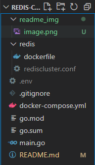
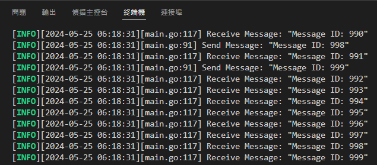

# Redis-Cluster-Stress-Testing
## Redis Cluster Environment Setup
The project directory will be organized as follows:

### Create `rediscluster.conf` File in the Redis Directory

Example configuration:

```shell
# IP
bind 0.0.0.0
# Enable cluster
cluster-enabled yes
# Specify cluster config file
cluster-config-file nodes.conf
# Specify node timeout
cluster-node-timeout 5000
# Set master connection password
masterauth "your_redis_password"
# Set replica connection password
requirepass "your_redis_password"
```

### Create .env File in the Project Root Directory
Example configuration:
```shell
ip="your_device_ip"
REDIS_PASSWORD="your_redis_password"  # Must match the password in rediscluster.conf
STREAM_NAME="your_stream_name"
CUSTOMER_GROUPNAME="your_customer_groupname"
```

### Start Redis Cluster
```shell
docker-compose up -d --build
```
### Check if Redis Cluster is Running Properly
```shell
redis-cli -a "your_redis_password" -p 7000 cluster info
```

If the output is similar to the following, the Redis Cluster is operating correctly:
```
cluster_state:ok
cluster_slots_assigned:16384
cluster_slots_ok:16384
cluster_slots_pfail:0
cluster_slots_fail:0
cluster_known_nodes:6
cluster_size:3
cluster_current_epoch:6
cluster_my_epoch:2
cluster_stats_messages_ping_sent:63
cluster_stats_messages_pong_sent:69
cluster_stats_messages_meet_sent:4
cluster_stats_messages_sent:136
cluster_stats_messages_ping_received:68
cluster_stats_messages_pong_received:67
cluster_stats_messages_meet_received:1
cluster_stats_messages_received:136
```

## Run the Producer-Consumer Model
* Run `main.go` directly in the project directory

If you see log information similar to the following output, the program has run successfully:


## References
1. https://pdai.tech/md/db/nosql-redis/db-redis-data-type-stream.html?source=post_page-----2a51f449343a--------------------------------
2. https://blog.yowko.com/docker-compose-redis-cluster/
3. https://www.yoyoask.com/?p=6051
4. https://blog.csdn.net/weixin_43798031/article/details/131322622
5. https://www.cnblogs.com/goldsunshine/p/17410148.html

# Redis-Cluster-Stress-Testing
## Redis cluster 環境配置
專案目錄將會如下

### 於 redis 資料夾中新增 rediscluster.conf 檔案
範例
```shell
# ip
bind 0.0.0.0
# 啟用 cluster
cluster-enabled yes
# 指定 cluster config 檔案
cluster-config-file nodes.conf
# 指定 node 無法連線時間
cluster-node-timeout 5000
#設置主服務的連接密碼
masterauth 「自行設定的 redis 資料庫密碼」
#設置從服務的連接密碼
requirepass 「自行設定的 redis 資料庫密碼」
```

### 於專案根目錄中新增 .env 檔案
範例
```shell
ip=「你的設備 IP」
REDIS_PASSWORD=「自行設定的 redis 資料庫密碼，要與 rediscluster.conf 一致」
STREAM_NAME= 「用來交換訊息的 stream name」
CUSTOMER_GROUPNAME=「customer 的 group name」
```

### 啟動 Redis Cluster
```shell
docker-compose up -d --build
```

### 確認 redis cluster 是否正常運作
```shell
redis-cli -a 「自行設定的 redis 資料庫密碼」 -p 7000 cluster info
```

如果輸出類似以下資訊，代表 Redis Cluster 已經正常運作
```
cluster_state:ok
cluster_slots_assigned:16384
cluster_slots_ok:16384
cluster_slots_pfail:0
cluster_slots_fail:0
cluster_known_nodes:6
cluster_size:3
cluster_current_epoch:6
cluster_my_epoch:2
cluster_stats_messages_ping_sent:63
cluster_stats_messages_pong_sent:69
cluster_stats_messages_meet_sent:4
cluster_stats_messages_sent:136
cluster_stats_messages_ping_received:68
cluster_stats_messages_pong_received:67
cluster_stats_messages_meet_received:1
cluster_stats_messages_received:136
```

## 執行 producer-consumer model
* 在專案目錄下直接執行 main.go 即可

如果看到類似以下輸出的 log 資訊，即為成功


## 參考資料
1. https://pdai.tech/md/db/nosql-redis/db-redis-data-type-stream.html?source=post_page-----2a51f449343a--------------------------------
2. https://blog.yowko.com/docker-compose-redis-cluster/
3. https://www.yoyoask.com/?p=6051
4. https://blog.csdn.net/weixin_43798031/article/details/131322622
5. https://www.cnblogs.com/goldsunshine/p/17410148.html

## 待做
1. XAUTOCLAIM 邏輯
2. 實驗: consumer拿掉，使 memory 漲超過 max memory，觀察發生什麼事
3. 實驗: 持續送過程中把 master 砍掉會發生什麼事，以及觀察 failover 機制
4. 實驗: 分別關掉 ACK 以及 Auto claim，觀察掉資料的情況