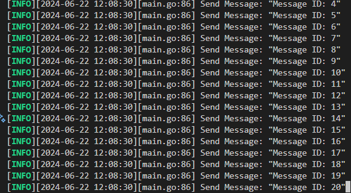
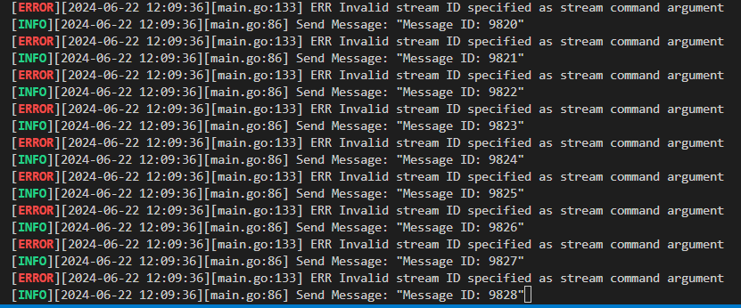
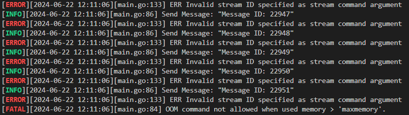
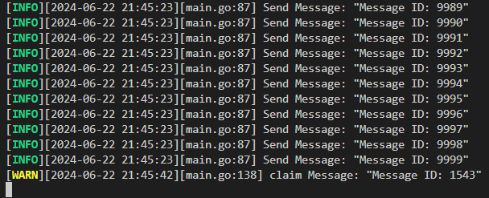

# Redis-Cluster-Stress-Testing
## Redis Cluster Environment Setup
The project directory will be organized as follows:

### Create `rediscluster.conf` File in the Redis Directory

Example configuration:

```shell
# IP
bind 0.0.0.0
# Enable cluster
cluster-enabled yes
# Specify cluster config file
cluster-config-file nodes.conf
# Specify node timeout
cluster-node-timeout 5000
# Set master connection password
masterauth "your_redis_password"
# Set replica connection password
requirepass "your_redis_password"
```

### Create .env File in the Project Root Directory
Example configuration:
```shell
ip="your_device_ip"
REDIS_PASSWORD="your_redis_password"  # Must match the password in rediscluster.conf
STREAM_NAME="your_stream_name"
CUSTOMER_GROUPNAME="your_customer_groupname"
```

### Start Redis Cluster
```shell
docker-compose up -d --build
```
### Check if Redis Cluster is Running Properly
```shell
redis-cli -a "your_redis_password" -p 7000 cluster info
```

If the output is similar to the following, the Redis Cluster is operating correctly:
```
cluster_state:ok
cluster_slots_assigned:16384
cluster_slots_ok:16384
cluster_slots_pfail:0
cluster_slots_fail:0
cluster_known_nodes:6
cluster_size:3
cluster_current_epoch:6
cluster_my_epoch:2
cluster_stats_messages_ping_sent:63
cluster_stats_messages_pong_sent:69
cluster_stats_messages_meet_sent:4
cluster_stats_messages_sent:136
cluster_stats_messages_ping_received:68
cluster_stats_messages_pong_received:67
cluster_stats_messages_meet_received:1
cluster_stats_messages_received:136
```

## Run the Producer-Consumer Model
* Run `main.go` directly in the project directory

If you see log information similar to the following output, the program has run successfully:


## Experiment
### Remove consumer, allow memory to exceed max memory, observe what happens
1. To expedite the experiment process, modify the docker compose file to limit Redis's max memory to 3MB, which is small enough for Redis to start but will quickly be exhausted by the producer's messages.
    ```yaml
    entrypoint: [redis-server, /etc/redis/rediscluster.conf, --port,"7000", --cluster-announce-ip,"${ip}", "--maxmemory", "3mb", "--maxmemory-policy", "allkeys-lru"]
    ```
2. Additionally, modify the `main.go` file to comment out the consumer part, leaving only the producer.
    ```go
    go Producer(log) // start producer
    AutoClaim(log)   // start auto claim, auto claim will claim messages that have been idle for 300 seconds
    //Consumer(log)     // start consumer
    ```
3. Navigate to the root directory of the project and start the Redis cluster with the following command:
    ```shell
    docker-compose up -d --build
    ```
4. Then start the producer-consumer model and observe the log output with the following command:
    ```shell
    go run main.go
    ```
5. Initially, the producer works normally, continuously sending messages to the Redis stream.
6. 
7. Around 8000 messages, AutoClaim encounters some unexpected errors, but the producer continues to work normally.
   
8. When the producer sends around 20000 messages, Redis's memory is completely exhausted, triggering an OOM error that terminates the program when the producer sends messages.
   

### Consequences of Removing the Master Node During Continuous Delivery and Observing Failover Mechanism
1. Navigate to the root directory of your project and start the Redis cluster using the following command:
    ```shell
    docker-compose up -d --build
    ```

2. Then, start the producer-consumer model using the following command:
    ```shell
    go run main.go
    ```

3. Use the following command to observe the Redis cluster status:
    ```shell
    redis-cli -a "replace with your redis password" -p 7005 cluster info
    ```
    Output:
    ```
    cluster_state:ok
    cluster_slots_assigned:16384
    cluster_slots_ok:16384
    cluster_slots_pfail:0
    cluster_slots_fail:0
    cluster_known_nodes:6
    cluster_size:3
    cluster_current_epoch:6
    cluster_my_epoch:2
    cluster_stats_messages_ping_sent:70
    cluster_stats_messages_pong_sent:72
    cluster_stats_messages_meet_sent:1
    cluster_stats_messages_sent:143
    cluster_stats_messages_ping_received:72
    cluster_stats_messages_pong_received:71
    cluster_stats_messages_received:143
    total_cluster_links_buffer_limit_exceeded:0
    ```

4. Use the following command to check the Redis cluster node status:
    ```shell
    redis-cli -a "replace with your redis password" -p 7005 cluster nodes
    ```
    Output:
    ```
    461be0b4a4543e5d9acd00942dd9b93b882115b7 26.9.179.171:7000@17000 master - 0 1718974312455 1 connected 0-5460
    d2cc64d7259a4230b757e5b52c74f742b4bc9e03 26.9.179.171:7004@17004 slave 461be0b4a4543e5d9acd00942dd9b93b882115b7 0 1718974311000 1 connected
    c3f97ac46e687af0940c42e56ad5b1774cdcfa2d 26.9.179.171:7001@17001 master - 0 1718974312000 2 connected 5461-10922
    52b55e41072d08db5710971d62b5dbd23676286a 26.9.179.171:7002@17002 master - 0 1718974311000 3 connected 10923-16383
    d4103efba01a43ff73a0dde1a00962d9c49015cb 26.9.179.171:7003@17003 slave 52b55e41072d08db5710971d62b5dbd23676286a 0 1718974311554 3 connected
    49c048b897ef0a9fd8fc90326bb9c7a5945e325f 26.9.179.171:7005@17005 myself,slave c3f97ac46e687af0940c42e56ad5b1774cdcfa2d 0 1718974311000 2 connected
    ```

5. Manually remove one master node (:7000 node) and observe that shortly after, the Redis cluster's `cluster_state` temporarily switches to `fail`, triggering a FATAL error in `main.go`:
    ```
    CLUSTERDOWN The cluster is down
    ```
    Soon after, the Redis cluster's `cluster_state` returns to `ok`, and after restarting `main.go`, the program runs successfully again. Check the Redis cluster node status:
    Output:
    ```
    461be0b4a4543e5d9acd00942dd9b93b882115b7 26.9.179.171:7000@17000 master,fail - 1718974349457 1718974347534 1 connected
    d2cc64d7259a4230b757e5b52c74f742b4bc9e03 26.9.179.171:7004@17004 master - 0 1718974388562 7 connected 0-5460
    c3f97ac46e687af0940c42e56ad5b1774cdcfa2d 26.9.179.171:7001@17001 master - 0 1718974388864 2 connected 5461-10922
    52b55e41072d08db5710971d62b5dbd23676286a 26.9.179.171:7002@17002 master - 0 1718974388000 3 connected 10923-16383
    d4103efba01a43ff73a0dde1a00962d9c49015cb 26.9.179.171:7003@17003 slave 52b55e41072d08db5710971d62b5dbd23676286a 0 1718974387000 3 connected
    49c048b897ef0a9fd8fc90326bb9c7a5945e325f 26.9.179.171:7005@17005 myself,master - 0 1718974387000 2 connected 5461-10922
    ```
    From the above output, observe that the original master node (:7000 node) has been marked as `fail`, and the original slave node (:7004 node) has been promoted to master.

6. Repeat the above steps to manually remove the :7001 node. Similar to removing :7000 node, shortly after removing :7001 node, Redis cluster's state temporarily switches to `fail`, triggering a FATAL error in `main.go`:
    ```
    CLUSTERDOWN The cluster is down
    ```
    Soon after, the Redis cluster's `cluster_state` returns to `ok`, and after restarting `main.go`, the program runs successfully again. Check the Redis cluster node status:
    Output:
    ```
    461be0b4a4543e5d9acd00942dd9b93b882115b7 26.9.179.171:7000@17000 master,fail - 1718974349457 1718974347534 1 connected
    d2cc64d7259a4230b757e5b52c74f742b4bc9e03 26.9.179.171:7004@17004 master - 0 1718974477310 7 connected 0-5460
    c3f97ac46e687af0940c42e56ad5b1774cdcfa2d 26.9.179.171:7001@17001 master,fail - 1718974429262 1718974428555 2 connected
    52b55e41072d08db5710971d62b5dbd23676286a 26.9.179.171:7002@17002 master - 0 1718974476000 3 connected 10923-16383
    d4103efba01a43ff73a0dde1a00962d9c49015cb 26.9.179.171:7003@17003 slave 52b55e41072d08db5710971d62b5dbd23676286a 0 1718974476288 3 connected
    49c048b897ef0a9fd8fc90326bb9c7a5945e325f 26.9.179.171:7005@17005 myself,master - 0 1718974477000 8 connected 5461-10922
    ```
    From the above output, observe that the original master node (:7001 node) has been marked as `fail`, and the original slave node (:7005 node) has been promoted to master.
7. Repeat the above steps, remove node :7002, observe the Redis cluster node status. This time, during the removal, main.go threw an EOF error:
    ```
    EOF
    ```
    Immediately after, the Redis cluster's `cluster_state` transitioned back to 'ok'. After restarting main.go, the program continued to execute successfully. Check the Redis cluster node status:
    ```
    461be0b4a4543e5d9acd00942dd9b93b882115b7 26.9.179.171:7000@17000 master,fail - 1718974349457 1718974347534 1 connected
    d2cc64d7259a4230b757e5b52c74f742b4bc9e03 26.9.179.171:7004@17004 master - 0 1718974584831 7 connected 0-5460
    c3f97ac46e687af0940c42e56ad5b1774cdcfa2d 26.9.179.171:7001@17001 master,fail - 1718974429262 1718974428555 2 connected
    52b55e41072d08db5710971d62b5dbd23676286a 26.9.179.171:7002@17002 master,fail - 1718974548970 1718974548688 3 disconnected
    d4103efba01a43ff73a0dde1a00962d9c49015cb 26.9.179.171:7003@17003 master - 0 1718974583825 9 connected 10923-16383
    49c048b897ef0a9fd8fc90326bb9c7a5945e325f 26.9.179.171:7005@17005 myself,master - 0 1718974584000 8 connected 5461-10922
    ```
    Observing the above output, we can see that the original master node (:7002 node) has been marked as failed, and the original slave node (:7003 node) has been promoted to master node.

8. Repeat the above steps, remove node :7003, observe the Redis cluster node status. This time, during the removal, main.go still threw an EOF error:
    ```
    EOF
    ```
    However, this time the Redis cluster's `cluster_state` remained in a failed state. After restarting main.go, the program couldn't connect to the Redis cluster anymore. Check the Redis cluster node status:
    ```
    461be0b4a4543e5d9acd00942dd9b93b882115b7 26.9.179.171:7000@17000 master,fail - 1718974349457 1718974347534 1 connected
    d2cc64d7259a4230b757e5b52c74f742b4bc9e03 26.9.179.171:7004@17004 master - 0 1718974899205 7 connected 0-5460
    c3f97ac46e687af0940c42e56ad5b1774cdcfa2d 26.9.179.171:7001@17001 master,fail - 1718974429262 1718974428555 2 connected
    52b55e41072d08db5710971d62b5dbd23676286a 26.9.179.171:7002@17002 master,fail - 1718974548970 1718974548688 3 connected
    d4103efba01a43ff73a0dde1a00962d9c49015cb 26.9.179.171:7003@17003 master,fail - 1718974730388 1718974729485 9 connected 10923-16383
    49c048b897ef0a9fd8fc90326bb9c7a5945e325f 26.9.179.171:7005@17005 myself,master - 0 1718974898000 8 connected 5461-10922
    ```
    This is likely because when a majority of master nodes fail, the Redis cluster can no longer provide service.

### Impact of Auto Claim on Data Loss
1. To simulate scenarios where data loss could occur, `main.go` was modified to introduce a small probability that the consumer may crash after reading messages but before processing them (not ACKed).
   

2. Navigate to the root directory of this project and start the Redis cluster with the following command:
    ```shell
    docker-compose up -d --build
    ```

3. Next, start the producer-consumer model to observe log outputs:
    ```shell
    go run main.go
    ```

4. Initially, both the producer and consumer operate normally. The producer continuously sends messages to the Redis stream, while the consumer retrieves messages from the stream. After some time, the consumer triggers a crash scenario where it reads messages but fails to process them. Meanwhile, the producer continues sending messages until completion. Eventually, if a message is detected to have been read without being ACKed for a certain duration, the Auto Claim mechanism automatically reclaims the message for processing. This means that without the Auto Claim mechanism, incompletely processed messages could potentially be lost.
   

### Impact of Enabling AOF on the Experimental Setup
* Experimenting with the `--appendonly` parameter in `docker-compose.yaml`:
  * Without AOF: 12.7363417s, 12.7807984s, 12.7780468s, average 12.7650623s
  * With AOF: 12.9400119s, 13.20815s, 12.9511132s, average 13.0330917s

* Observation reveals that enabling AOF indeed affects performance.

## References
1. https://pdai.tech/md/db/nosql-redis/db-redis-data-type-stream.html?source=post_page-----2a51f449343a--------------------------------
2. https://blog.yowko.com/docker-compose-redis-cluster/
3. https://www.yoyoask.com/?p=6051
4. https://blog.csdn.net/weixin_43798031/article/details/131322622
5. https://www.cnblogs.com/goldsunshine/p/17410148.html

# Redis-Cluster-Stress-Testing
## Redis cluster 環境配置
專案目錄將會如下

### 於 redis 資料夾中新增 rediscluster.conf 檔案
範例
```shell
# ip
bind 0.0.0.0
# 啟用 cluster
cluster-enabled yes
# 指定 cluster config 檔案
cluster-config-file nodes.conf
# 指定 node 無法連線時間
cluster-node-timeout 5000
#設置主服務的連接密碼
masterauth 「自行設定的 redis 資料庫密碼」
#設置從服務的連接密碼
requirepass 「自行設定的 redis 資料庫密碼」
```

### 於專案根目錄中新增 .env 檔案
範例
```shell
ip=「你的設備 IP」
REDIS_PASSWORD=「自行設定的 redis 資料庫密碼，要與 rediscluster.conf 一致」
STREAM_NAME= 「用來交換訊息的 stream name」
CUSTOMER_GROUPNAME=「customer 的 group name」
```

### 啟動 Redis Cluster
```shell
docker-compose up -d --build
```

### 確認 redis cluster 是否正常運作
```shell
redis-cli -a 「自行設定的 redis 資料庫密碼」 -p 7000 cluster info
```

如果輸出類似以下資訊，代表 Redis Cluster 已經正常運作
```
cluster_state:ok
cluster_slots_assigned:16384
cluster_slots_ok:16384
cluster_slots_pfail:0
cluster_slots_fail:0
cluster_known_nodes:6
cluster_size:3
cluster_current_epoch:6
cluster_my_epoch:2
cluster_stats_messages_ping_sent:63
cluster_stats_messages_pong_sent:69
cluster_stats_messages_meet_sent:4
cluster_stats_messages_sent:136
cluster_stats_messages_ping_received:68
cluster_stats_messages_pong_received:67
cluster_stats_messages_meet_received:1
cluster_stats_messages_received:136
```

## 執行 producer-consumer model
* 在專案目錄下直接執行 main.go 即可

如果看到類似以下輸出的 log 資訊，即為成功


## 實驗
### consumer拿掉，使 memory 漲超過 max memory，觀察發生什麼事
1. 為了加速實驗過程，透過修改 docker compose file，限制 redis 的 max memory 為 3MB，這個大小能夠讓 redis 順利啟動，但很快便會被 producer 的訊息耗盡
    ```yaml
    entrypoint: [redis-server, /etc/redis/rediscluster.conf, --port,"7000", --cluster-announce-ip,"${ip}", "--maxmemory", "3mb", "--maxmemory-policy", "allkeys-lru"]
    ```
2. 此外，修改 main.go 中的程式，註解掉 consumer 的部分，只留下 producer
    ```go
	go Producer(log) // start producer
	AutoClaim(log)   // start auto claim, auto claim will claim messages that have been idle for 300 seconds
	//Consumer(log)     // start consumer
    ```
2. 來到本專案根目錄下，先使用以下指令啟動 redis cluster
    ```shell
    docker-compose up -d --build
    ```
3. 接著透過以下指令啟動 producer-consumer model 並觀察 log 輸出
    ```shell
    go run main.go
    ```
4. producer 一開始正常運作，不斷送出 message 至 redis stream 中
5. 
6. 直到送到約 8000 筆訊息時，AutoClaim 的部分出現了一些不可預期的錯誤，但此時 producer 仍正常工作
   
7. 當 producer 送到約 20000 筆訊息時，redis 的 memory 全被耗盡，在 producer 送訊息時觸發了終止程式的 OOM 錯誤
   

### 持續送過程中把 master 砍掉會發生什麼事，以及觀察 failover 機制
1. 來到本專案根目錄下，先使用以下指令啟動 redis cluster
    ```shell
    docker-compose up -d --build
    ```
2. 接著透過以下指令啟動 producer-consumer model
    ```shell
    go run main.go
    ```
3. 透過以下指令觀察 redis cluster 狀態
    ```shell
    redis-cli -a "replace with your redis password" -p 7005 cluster info
    ```
    輸出:
    ```
    cluster_state:ok
    cluster_slots_assigned:16384
    cluster_slots_ok:16384
    cluster_slots_pfail:0
    cluster_slots_fail:0
    cluster_known_nodes:6
    cluster_size:3
    cluster_current_epoch:6
    cluster_my_epoch:2
    cluster_stats_messages_ping_sent:70
    cluster_stats_messages_pong_sent:72
    cluster_stats_messages_meet_sent:1
    cluster_stats_messages_sent:143
    cluster_stats_messages_ping_received:72
    cluster_stats_messages_pong_received:71
    cluster_stats_messages_received:143
    total_cluster_links_buffer_limit_exceeded:0
    ```
4. 透過以下指令觀察 redis cluster node 狀態
    ```shell
    redis-cli -a "replace with your redis password" -p 7005 cluster nodes
    ```
    輸出:
    ```
    461be0b4a4543e5d9acd00942dd9b93b882115b7 26.9.179.171:7000@17000 master - 0 1718974312455 1 connected 0-5460
    d2cc64d7259a4230b757e5b52c74f742b4bc9e03 26.9.179.171:7004@17004 slave 461be0b4a4543e5d9acd00942dd9b93b882115b7 0 1718974311000 1 connected
    c3f97ac46e687af0940c42e56ad5b1774cdcfa2d 26.9.179.171:7001@17001 master - 0 1718974312000 2 connected 5461-10922
    52b55e41072d08db5710971d62b5dbd23676286a 26.9.179.171:7002@17002 master - 0 1718974311000 3 connected 10923-16383
    d4103efba01a43ff73a0dde1a00962d9c49015cb 26.9.179.171:7003@17003 slave 52b55e41072d08db5710971d62b5dbd23676286a 0 1718974311554 3 connected
    49c048b897ef0a9fd8fc90326bb9c7a5945e325f 26.9.179.171:7005@17005 myself,slave c3f97ac46e687af0940c42e56ad5b1774cdcfa2d 0 1718974311000 2 connected
    ```
5. 手動砍掉一個 master node (:7000 node)，會發現數秒後， redis cluster 的 cluster_state 暫時轉成 fail，以至於觸發 main.go 中的 FATAL 錯誤
    ```
    CLUSTERDOWN The cluster is down
    ```
    緊接著 redis cluster 的 cluster_state 再次轉成 ok，重啟 main.go 後程式也順利執行。查看 redis cluster node 狀態
    輸出:
    ```
    461be0b4a4543e5d9acd00942dd9b93b882115b7 26.9.179.171:7000@17000 master,fail - 1718974349457 1718974347534 1 connected
    d2cc64d7259a4230b757e5b52c74f742b4bc9e03 26.9.179.171:7004@17004 master - 0 1718974388562 7 connected 0-5460
    c3f97ac46e687af0940c42e56ad5b1774cdcfa2d 26.9.179.171:7001@17001 master - 0 1718974388864 2 connected 5461-10922
    52b55e41072d08db5710971d62b5dbd23676286a 26.9.179.171:7002@17002 master - 0 1718974388000 3 connected 10923-16383
    d4103efba01a43ff73a0dde1a00962d9c49015cb 26.9.179.171:7003@17003 slave 52b55e41072d08db5710971d62b5dbd23676286a 0 1718974387000 3 connected
    49c048b897ef0a9fd8fc90326bb9c7a5945e325f 26.9.179.171:7005@17005 myself,slave c3f97ac46e687af0940c42e56ad5b1774cdcfa2d 0 1718974387000 2 connected
    ```
    觀察上述輸出，可以發現原本的 master 節點 (:7000 node) 已經被標記為 fail，並且原本的 slave node (:7004 node) 被提升成 master node
6. 接著再手動砍掉一個 master node (:7001 node)，跟砍掉 :7000 node 時相同，會發現數秒後， redis cluster 的 state 暫時轉成 fail，以至於觸發 main.go 中的 FATAL 錯誤
    ```
    CLUSTERDOWN The cluster is down
    ```
    緊接著 redis cluster 的 cluster_state 再次轉成 ok，重啟 main.go 後程式也順利執行。查看 redis cluster node 狀態
    輸出:
    ```
    461be0b4a4543e5d9acd00942dd9b93b882115b7 26.9.179.171:7000@17000 master,fail - 1718974349457 1718974347534 1 connected
    d2cc64d7259a4230b757e5b52c74f742b4bc9e03 26.9.179.171:7004@17004 master - 0 1718974477310 7 connected 0-5460
    c3f97ac46e687af0940c42e56ad5b1774cdcfa2d 26.9.179.171:7001@17001 master,fail - 1718974429262 1718974428555 2 connected
    52b55e41072d08db5710971d62b5dbd23676286a 26.9.179.171:7002@17002 master - 0 1718974476000 3 connected 10923-16383
    d4103efba01a43ff73a0dde1a00962d9c49015cb 26.9.179.171:7003@17003 slave 52b55e41072d08db5710971d62b5dbd23676286a 0 1718974476288 3 connected
    49c048b897ef0a9fd8fc90326bb9c7a5945e325f 26.9.179.171:7005@17005 myself,master - 0 1718974477000 8 connected 5461-10922
    ```
    觀察上述輸出，可以發現原本的 master 節點 (:7001 node) 已經被標記為 fail，並且原本的 slave node (:7005 node) 被提升成 master node
7. 重複上述步驟，砍掉 :7002 node，觀察 redis cluster node 狀態，這次在砍掉的瞬間，main.go 跳出了 EOF 的錯誤
    ```
    EOF
    ```
    緊接著 redis cluster 的 cluster_state 再次轉成 ok，重啟 main.go 後程式仍能順利執行。查看 redis cluster node 狀態
    輸出:
    ```
    461be0b4a4543e5d9acd00942dd9b93b882115b7 26.9.179.171:7000@17000 master,fail - 1718974349457 1718974347534 1 connected
    d2cc64d7259a4230b757e5b52c74f742b4bc9e03 26.9.179.171:7004@17004 master - 0 1718974584831 7 connected 0-5460
    c3f97ac46e687af0940c42e56ad5b1774cdcfa2d 26.9.179.171:7001@17001 master,fail - 1718974429262 1718974428555 2 connected
    52b55e41072d08db5710971d62b5dbd23676286a 26.9.179.171:7002@17002 master,fail - 1718974548970 1718974548688 3 disconnected
    d4103efba01a43ff73a0dde1a00962d9c49015cb 26.9.179.171:7003@17003 master - 0 1718974583825 9 connected 10923-16383
    49c048b897ef0a9fd8fc90326bb9c7a5945e325f 26.9.179.171:7005@17005 myself,master - 0 1718974584000 8 connected 5461-10922
    ```
    觀察上述輸出，可以發現原本的 master 節點 (:7002 node) 已經被標記為 fail，並且原本的 slave node (:7003 node) 被提升成 master node
8. 重複上述步驟，砍掉 :7003 node，觀察 redis cluster node 狀態，這次在砍掉的瞬間，main.go 還是跳出了 EOF 的錯誤
    ```
    EOF
    ```
    但這次 redis cluster 的 cluster_state 繼續維持 fail 狀態，重啟 main.go 後程式也連不上 redis cluster。查看 redis cluster node 狀態
    輸出:
    ```
    461be0b4a4543e5d9acd00942dd9b93b882115b7 26.9.179.171:7000@17000 master,fail - 1718974349457 1718974347534 1 connected
    d2cc64d7259a4230b757e5b52c74f742b4bc9e03 26.9.179.171:7004@17004 master - 0 1718974899205 7 connected 0-5460
    c3f97ac46e687af0940c42e56ad5b1774cdcfa2d 26.9.179.171:7001@17001 master,fail - 1718974429262 1718974428555 2 connected
    52b55e41072d08db5710971d62b5dbd23676286a 26.9.179.171:7002@17002 master,fail - 1718974548970 1718974548688 3 connected
    d4103efba01a43ff73a0dde1a00962d9c49015cb 26.9.179.171:7003@17003 master,fail - 1718974730388 1718974729485 9 connected 10923-16383
    49c048b897ef0a9fd8fc90326bb9c7a5945e325f 26.9.179.171:7005@17005 myself,master - 0 1718974898000 8 connected 5461-10922
    ```
    這應該是因為過半數 master node 失效時，redis cluster 將無法繼續提供服務

### Auto claim 對於掉資料的影響
1. 為了模擬掉資料可能發生的情境，故修改了 main.go，讓 consumer 有小概率會發生當機，讀取了訊息卻未處理完畢 (未 ACK)
   
2. 來到本專案根目錄下，先使用以下指令啟動 redis cluster
    ```shell
    docker-compose up -d --build
    ```
3. 接著透過以下指令啟動 producer-consumer model，觀察 log 輸出
    ```shell
    go run main.go
    ```
4. 一開始執行時，producer 以及 consumer 都正常運作，producer 不斷送出 message 至 redis stream 中，而 consumer 也不斷地從 stream 中取出訊息，但經過一段時間後，consumer 觸發了當機機制，讀取了訊息卻未處理完畢；而 producer 仍然持續送出訊息，直到將訊息送完。最後，在偵測到某個 message 讀取後未 ACK 一段時間，Auto claim 機制將會自動將該訊息重新 claim 回來處理；也就是說，若是沒有 Auto claim 機制，則未處理完的訊息可能丟失
   

### 是否開啟 Aof 對本次實驗架構的影響
* 透過修改 docker-compose.yaml 中的 --appendonly 參數進行實驗
  * 未開啟 Aof: 12.7363417s, 12.7807984s, 12.7780468s, 平均 12.7650623s
  * 有開啟 Aof: 12.9400119s, 13.20815s, 12.9511132s, 平均 13.0330917s
* 觀察發現，開啟 Aof 確實會對性能有所影響
## 參考資料
1. https://pdai.tech/md/db/nosql-redis/db-redis-data-type-stream.html?source=post_page-----2a51f449343a--------------------------------
2. https://blog.yowko.com/docker-compose-redis-cluster/
3. https://www.yoyoask.com/?p=6051
4. https://blog.csdn.net/weixin_43798031/article/details/131322622
5. https://www.cnblogs.com/goldsunshine/p/17410148.html

## 待做
- [x] XAUTOCLAIM 邏輯
- [x] 實驗: consumer拿掉，使 memory 漲超過 max memory，觀察發生什麼事
- [x] 實驗: 持續送過程中把 master 砍掉會發生什麼事，以及觀察 failover 機制
- [x] 實驗: 關掉Auto claim，觀察掉資料的情況
- [x] 是否開啟 Aof 對本次實驗架構的影響