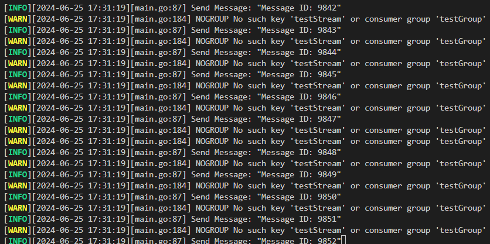

# Redis-Cluster-Stress-Testing
## Redis Cluster Environment Setup
The project directory will be organized as follows:

### Create `rediscluster.conf` File in the Redis Directory

Example configuration:

```shell
# IP
bind 0.0.0.0
# Enable cluster
cluster-enabled yes
# Specify cluster config file
cluster-config-file nodes.conf
# Specify node timeout
cluster-node-timeout 5000
# Set master connection password
masterauth "your_redis_password"
# Set replica connection password
requirepass "your_redis_password"
```

### Create .env File in the Project Root Directory
Example configuration:
```shell
ip="your_device_ip"
REDIS_PASSWORD="your_redis_password"  # Must match the password in rediscluster.conf
STREAM_NAME="your_stream_name"
CUSTOMER_GROUPNAME="your_customer_groupname"
```

### Start Redis Cluster
```shell
docker-compose up -d --build
```
### Check if Redis Cluster is Running Properly
```shell
redis-cli -a "your_redis_password" -p 7000 cluster info
```

If the output is similar to the following, the Redis Cluster is operating correctly:
```
cluster_state:ok
cluster_slots_assigned:16384
cluster_slots_ok:16384
cluster_slots_pfail:0
cluster_slots_fail:0
cluster_known_nodes:6
cluster_size:3
cluster_current_epoch:6
cluster_my_epoch:2
cluster_stats_messages_ping_sent:63
cluster_stats_messages_pong_sent:69
cluster_stats_messages_meet_sent:4
cluster_stats_messages_sent:136
cluster_stats_messages_ping_received:68
cluster_stats_messages_pong_received:67
cluster_stats_messages_meet_received:1
cluster_stats_messages_received:136
```

### Check Redis Cluster Node Status
```shell
redis-cli -a "your_redis_password" -p 7000 cluster nodes
```

If the output is similar to the following, the Redis Cluster is operating correctly:
```shell
7e793eb8a2134550d9a285713f52ddaf8cc89189 26.9.179.171:7003@17003 slave 7651df59f610c9619ea8ecef840737344a762e12 0 1719301574086 3 connected       
a1c228d29fba6e1e0360f0caf5863f33688a93d0 26.9.179.171:7004@17004 master - 0 1719301573000 7 connected 0-5460
890b48ca513fd553e3319505e442c751cd25a1ea 26.9.179.171:7000@17000 myself,slave a1c228d29fba6e1e0360f0caf5863f33688a93d0 0 1719301573000 7 connected
cc4a188cf6ba936c097776f1a1fe203395f710bb 26.9.179.171:7001@17001 slave eb672df8d3073c0327084123bda8f022216b239e 0 1719301574488 8 connected       
eb672df8d3073c0327084123bda8f022216b239e 26.9.179.171:7005@17005 master - 0 1719301572982 8 connected 5461-10922
7651df59f610c9619ea8ecef840737344a762e12 26.9.179.171:7002@17002 master - 0 1719301573485 3 connected 10923-16383
```

## Run the Producer-Consumer Model
* Run `main.go` directly in the project directory

If you see log information similar to the following output, the program has run successfully:


## Experiment
### Remove consumer, let memory exceed max memory, and observe what happens
1. To speed up the experiment process, modify the docker compose file to limit Redis's max memory to 3MB. This size allows Redis to start successfully but will quickly be exhausted by the producer's messages.
    ```yaml
    entrypoint: [redis-server, /etc/redis/rediscluster.conf, --port,"7000", --cluster-announce-ip,"${ip}", --appendonly, yes, "--maxmemory", "3mb", "--maxmemory-policy", "allkeys-lru"]
    ```
2. Additionally, modify the program in `main.go` by commenting out the consumer part, leaving only the producer.
    ```go
	go Producer(log) // start producer
	AutoClaim(log)   // start auto claim, auto claim will claim messages that have been idle for 300 seconds
	//Consumer(log)     // start consumer
    ```
3. Navigate to the root directory of this project and start the Redis cluster with the following command:
    ```shell
    docker-compose up -d --build
    ```
4. Then start the producer-consumer model and observe the log output with the following command:
    ```shell
    go run main.go
    ```
5. The producer initially works normally, continuously sending messages to the Redis stream.
   
6. After sending about 9000 messages, the AutoClaim part encounters some unexpected errors, but the producer continues to work normally.
   
7. When the producer sends about 20000 messages, Redis's memory is completely exhausted, and even the producer triggers OOM (Out of Memory) errors while sending messages. After exhausting the retry count, the program stops running.
   

### Observe what happens when a master is killed during continuous sending and the failover mechanism
1. Navigate to the root directory of this project and start the Redis cluster with the following command:
    ```shell
    docker-compose up -d --build
    ```
2. Then start the producer-consumer model with the following command:
    ```shell
    go run main.go
    ```
3. Check the Redis cluster status with the following command:
    ```shell
    redis-cli -a "replace with your redis password" -p 7005 cluster info
    ```
    Output:
    ```
    cluster_state:ok
    cluster_slots_assigned:16384
    cluster_slots_ok:16384
    cluster_slots_pfail:0
    cluster_slots_fail:0
    cluster_known_nodes:6
    cluster_size:3
    cluster_current_epoch:6
    cluster_my_epoch:3
    cluster_stats_messages_ping_sent:19
    cluster_stats_messages_pong_sent:17
    cluster_stats_messages_meet_sent:1
    cluster_stats_messages_sent:37
    cluster_stats_messages_ping_received:17
    cluster_stats_messages_pong_received:20
    cluster_stats_messages_received:37
    total_cluster_links_buffer_limit_exceeded:0
    ```
4. Check the Redis cluster node status with the following command:
    ```shell
    redis-cli -a "replace with your redis password" -p 7005 cluster nodes
    ```
    Output:
    ```
    9e1b9f1122acf92f85c0986d37872294a691d55b 26.9.179.171:7005@17005 slave 230310e5c4ef0c4e544c2f22e71a5cf74c7ce0a8 0 1719308437906 3 connected
    e3e0441634d8a6cd332d0698165d83dac6064dd9 26.9.179.171:7003@17003 slave b4ac2b113e50c5bc20c9b422b8c5ffc6e9248189 0 1719308437000 1 connected
    b4ac2b113e50c5bc20c9b422b8c5ffc6e9248189 26.9.179.171:7000@17000 myself,master - 0 1719308437000 1 connected 0-5460
    a62ff34550f00412fbb2024e0ca40c4f274ef5c6 26.9.179.171:7004@17004 slave 69b216af950a9ae48ac7a44200dfa87b9f0f67aa 0 1719308438911 2 connected
    69b216af950a9ae48ac7a44200dfa87b9f0f67aa 26.9.179.171:7001@17001 master - 0 1719308438509 2 connected 5461-10922
    230310e5c4ef0c4e544c2f22e71a5cf74c7ce0a8 26.9.179.171:7002@17002 master - 0 1719308437505 3 connected 10923-16383
    ```
5. In Docker, manually restart a master node (e.g., the :7000 node). You'll find that the "master node restart time" is shorter than the "time for Redis cluster failover mechanism to determine that the node has failed." This means the master node restarts in time before being marked as failed and continues to operate without being switched to a slave. The producer-consumer model also continues to operate normally.
    
6. To simulate triggering a failover, manually pause the master node (:7000). After a few seconds, the Redis cluster goes temporarily offline, causing the producer-consumer model to keep retrying. After about 0.1 seconds, the Redis cluster resumes normal operation, and the producer-consumer model continues to operate normally.
    
    
7. Finally, manually restart the previously paused node (:7000). You'll find that the node has been switched to a slave without affecting the operation of the producer-consumer model.
    

### Impact of Auto Claim on Data Loss
1. To simulate scenarios where data loss may occur, the ConsumingMessage part in main.go was uncommented, allowing the consumer to occasionally crash after reading messages without processing them (not ACKed). Additionally, adjusting the number of messages sent and the triggering time of Auto Claim can also affect this scenario.
   
2. Navigate to the root directory of this project and start the Redis cluster with the following command:
    ```shell
    docker-compose up -d --build
    ```
3. Then start the producer-consumer model and observe the log output with the following command:
    ```shell
    go run main.go
    ```
4. Initially, both the producer and consumer operate normally. The producer continuously sends messages to the Redis stream, and the consumer retrieves messages from the stream. However, after some time, the consumer triggers the crash mechanism after reading messages without processing them. The producer continues to send messages until all are sent. Finally, if a message is detected to have been read but not ACKed for a period, the Auto Claim mechanism automatically reclaims the message for processing. Without the Auto Claim mechanism, these unprocessed messages could be lost.
   

### Impact of AOF (Append-Only File) on the Experiment Structure
* Experiment conducted by modifying the --appendonly parameter in docker-compose.yaml:
  * Without AOF: 12.6642449s, 12.7502929s, 12.6436454s, average 12.6860611s
  * With AOF: 13.1419384s, 12.8154547s, 13.0021116s, average 12.9865016s
* It is observed that enabling AOF does slightly impact performance.

## References
1. https://pdai.tech/md/db/nosql-redis/db-redis-data-type-stream.html?source=post_page-----2a51f449343a--------------------------------
2. https://blog.yowko.com/docker-compose-redis-cluster/
3. https://www.yoyoask.com/?p=6051
4. https://blog.csdn.net/weixin_43798031/article/details/131322622
5. https://www.cnblogs.com/goldsunshine/p/17410148.html

# Redis-Cluster-Stress-Testing
## Redis cluster 環境配置
專案目錄將會如下

### 於 redis 資料夾中新增 rediscluster.conf 檔案
範例
```shell
# ip
bind 0.0.0.0
# 啟用 cluster
cluster-enabled yes
# 指定 cluster config 檔案
cluster-config-file nodes.conf
# 指定 node 無法連線時間
cluster-node-timeout 5000
#設置主服務的連接密碼
masterauth 「自行設定的 redis 資料庫密碼」
#設置從服務的連接密碼
requirepass 「自行設定的 redis 資料庫密碼」
```

### 於專案根目錄中新增 .env 檔案
範例
```shell
ip=「你的設備 IP」
REDIS_PASSWORD=「自行設定的 redis 資料庫密碼，要與 rediscluster.conf 一致」
STREAM_NAME= 「用來交換訊息的 stream name」
CUSTOMER_GROUPNAME=「customer 的 group name」
```

### 啟動 Redis Cluster
```shell
docker-compose up -d --build
```

### 確認 redis cluster 是否正常運作
```shell
redis-cli -a 「自行設定的 redis 資料庫密碼」 -p 7000 cluster info
```

如果輸出類似以下資訊，代表 Redis Cluster 已經正常運作
```
cluster_state:ok
cluster_slots_assigned:16384
cluster_slots_ok:16384
cluster_slots_pfail:0
cluster_slots_fail:0
cluster_known_nodes:6
cluster_size:3
cluster_current_epoch:6
cluster_my_epoch:2
cluster_stats_messages_ping_sent:63
cluster_stats_messages_pong_sent:69
cluster_stats_messages_meet_sent:4
cluster_stats_messages_sent:136
cluster_stats_messages_ping_received:68
cluster_stats_messages_pong_received:67
cluster_stats_messages_meet_received:1
cluster_stats_messages_received:136
```

### 查看 Redis Cluster node 狀態
```shell
redis-cli -a 「自行設定的 redis 資料庫密碼」 -p 7000 cluster nodes
```

如果輸出類似以下資訊，代表 Redis Cluster 已經正常運作
```shell
7e793eb8a2134550d9a285713f52ddaf8cc89189 26.9.179.171:7003@17003 slave 7651df59f610c9619ea8ecef840737344a762e12 0 1719301574086 3 connected       
a1c228d29fba6e1e0360f0caf5863f33688a93d0 26.9.179.171:7004@17004 master - 0 1719301573000 7 connected 0-5460
890b48ca513fd553e3319505e442c751cd25a1ea 26.9.179.171:7000@17000 myself,slave a1c228d29fba6e1e0360f0caf5863f33688a93d0 0 1719301573000 7 connected
cc4a188cf6ba936c097776f1a1fe203395f710bb 26.9.179.171:7001@17001 slave eb672df8d3073c0327084123bda8f022216b239e 0 1719301574488 8 connected       
eb672df8d3073c0327084123bda8f022216b239e 26.9.179.171:7005@17005 master - 0 1719301572982 8 connected 5461-10922
7651df59f610c9619ea8ecef840737344a762e12 26.9.179.171:7002@17002 master - 0 1719301573485 3 connected 10923-16383
```

## 執行 producer-consumer model
* 在專案目錄下直接執行 main.go 即可

如果看到類似以下輸出的 log 資訊，即為成功


## 實驗
### consumer拿掉，使 memory 漲超過 max memory，觀察發生什麼事
1. 為了加速實驗過程，透過修改 docker compose file，限制 redis 的 max memory 為 3MB，這個大小能夠讓 redis 順利啟動，但很快便會被 producer 的訊息耗盡
    ```yaml
    entrypoint: [redis-server, /etc/redis/rediscluster.conf, --port,"7000", --cluster-announce-ip,"${ip}", --appendonly, yes, "--maxmemory", "3mb", "--maxmemory-policy", "allkeys-lru"]
    ```
2. 此外，修改 main.go 中的程式，註解掉 consumer 的部分，只留下 producer
    ```go
	go Producer(log) // start producer
	AutoClaim(log)   // start auto claim, auto claim will claim messages that have been idle for 300 seconds
	//Consumer(log)     // start consumer
    ```
2. 來到本專案根目錄下，先使用以下指令啟動 redis cluster
    ```shell
    docker-compose up -d --build
    ```
3. 接著透過以下指令啟動 producer-consumer model 並觀察 log 輸出
    ```shell
    go run main.go
    ```
4. producer 一開始正常運作，不斷送出 message 至 redis stream 中
   
5. 直到送到約 9000 筆訊息時，AutoClaim 的部分出現了一些不可預期的錯誤，但此時 producer 仍正常工作
   
6. 當 producer 送到約 20000 筆訊息時，redis 的 memory 全被耗盡，連 producer 送訊息時都觸發了 OOM 錯誤；在耗盡 retry 次數後，程式中止運作
   

### 持續送過程中把 master 砍掉會發生什麼事，以及觀察 failover 機制
1. 來到本專案根目錄下，先使用以下指令啟動 redis cluster
    ```shell
    docker-compose up -d --build
    ```
2. 接著透過以下指令啟動 producer-consumer model
    ```shell
    go run main.go
    ```
3. 透過以下指令觀察 redis cluster 狀態
    ```shell
    redis-cli -a "replace with your redis password" -p 7005 cluster info
    ```
    輸出:
    ```
    cluster_state:ok
    cluster_slots_assigned:16384
    cluster_slots_ok:16384
    cluster_slots_pfail:0
    cluster_slots_fail:0
    cluster_known_nodes:6
    cluster_size:3
    cluster_current_epoch:6
    cluster_my_epoch:3
    cluster_stats_messages_ping_sent:19
    cluster_stats_messages_pong_sent:17
    cluster_stats_messages_meet_sent:1
    cluster_stats_messages_sent:37
    cluster_stats_messages_ping_received:17
    cluster_stats_messages_pong_received:20
    cluster_stats_messages_received:37
    total_cluster_links_buffer_limit_exceeded:0
    ```
4. 透過以下指令觀察 redis cluster node 狀態
    ```shell
    redis-cli -a "replace with your redis password" -p 7005 cluster nodes
    ```
    輸出:
    ```
    9e1b9f1122acf92f85c0986d37872294a691d55b 26.9.179.171:7005@17005 slave 230310e5c4ef0c4e544c2f22e71a5cf74c7ce0a8 0 1719308437906 3 connected
    e3e0441634d8a6cd332d0698165d83dac6064dd9 26.9.179.171:7003@17003 slave b4ac2b113e50c5bc20c9b422b8c5ffc6e9248189 0 1719308437000 1 connected
    b4ac2b113e50c5bc20c9b422b8c5ffc6e9248189 26.9.179.171:7000@17000 myself,master - 0 1719308437000 1 connected 0-5460
    a62ff34550f00412fbb2024e0ca40c4f274ef5c6 26.9.179.171:7004@17004 slave 69b216af950a9ae48ac7a44200dfa87b9f0f67aa 0 1719308438911 2 connected
    69b216af950a9ae48ac7a44200dfa87b9f0f67aa 26.9.179.171:7001@17001 master - 0 1719308438509 2 connected 5461-10922
    230310e5c4ef0c4e544c2f22e71a5cf74c7ce0a8 26.9.179.171:7002@17002 master - 0 1719308437505 3 connected 10923-16383
    ```
5. 在 docker 中，手動重啟一個 master 節點 (:7000 node)，會發現 "master 節點重啟的時間" 比 "redis cluster failover 機制判斷該節點 fail 的時間" 還短；也就是說，該 master 節點在被判定 fail 前，便即時重啟完畢，繼續運作，並沒有被切換成 slave；producer-consumer model 也正常運作
    
6. 接著為了模擬觸發 failover 的情況，手動暫停 master 節點 (:7000 node) 運作。經過數秒後， redis cluster 暫時下線，並使 producer-consumer model 不斷 retry，再經過約 0.1 秒後，redis cluster 恢復正常運作，producer-consumer model 也正常運作
    
    
7. 接著手動重啟剛剛暫停的節點 (:7000 node)，會發現該節點被切換成 slave，且不影響 producer-consumer model 的運作
    

### Auto claim 對於掉資料的影響
1. 為了模擬掉資料可能發生的情境，故移除 main.go 中 ConsumingMessage 的部分註解，讓 consumer 有小概率會發生當機，讀取了訊息卻未處理完畢 (未 ACK)，此外，也可以適當調整發送的 message 數量以及觸發 Auto claim 的時間
   
2. 來到本專案根目錄下，先使用以下指令啟動 redis cluster
    ```shell
    docker-compose up -d --build
    ```
3. 接著透過以下指令啟動 producer-consumer model，觀察 log 輸出
    ```shell
    go run main.go
    ```
4. 一開始執行時，producer 以及 consumer 都正常運作，producer 不斷送出 message 至 redis stream 中，而 consumer 也不斷地從 stream 中取出訊息，但經過一段時間後，consumer 觸發了當機機制，讀取了訊息卻未處理完畢；而 producer 仍然持續送出訊息，直到將訊息送完。最後，在偵測到某個 message 讀取後未 ACK 一段時間，Auto claim 機制將會自動將該訊息重新 claim 回來處理；也就是說，若是沒有 Auto claim 機制，則未處理完的訊息可能丟失
    

### 是否開啟 Aof 對本次實驗架構的影響
* 透過修改 docker-compose.yaml 中的 --appendonly 參數進行實驗
  * 未開啟 Aof: 12.6642449s, 12.7502929s, 12.6436454s, 平均 12.6860611s
  * 有開啟 Aof: 13.1419384s, 12.8154547s, 13.0021116s, 平均 12.9865016s
* 觀察發現，開啟 Aof 確實會對性能略有影響

## 參考資料
1. https://pdai.tech/md/db/nosql-redis/db-redis-data-type-stream.html?source=post_page-----2a51f449343a--------------------------------
2. https://blog.yowko.com/docker-compose-redis-cluster/
3. https://www.yoyoask.com/?p=6051
4. https://blog.csdn.net/weixin_43798031/article/details/131322622
5. https://www.cnblogs.com/goldsunshine/p/17410148.html

## 待做
- [x] XAUTOCLAIM 邏輯
- [x] 實驗: consumer拿掉，使 memory 漲超過 max memory，觀察發生什麼事
- [x] 實驗: 持續送過程中把 master 砍掉會發生什麼事，以及觀察 failover 機制
- [x] 實驗: 關掉Auto claim，觀察掉資料的情況
- [x] 是否開啟 Aof 對本次實驗架構的影響