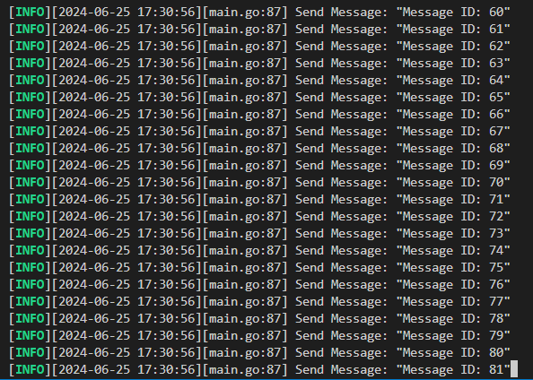
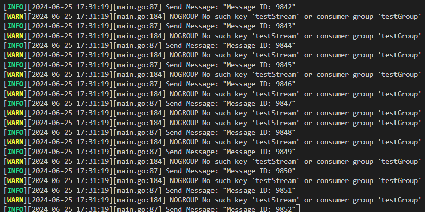
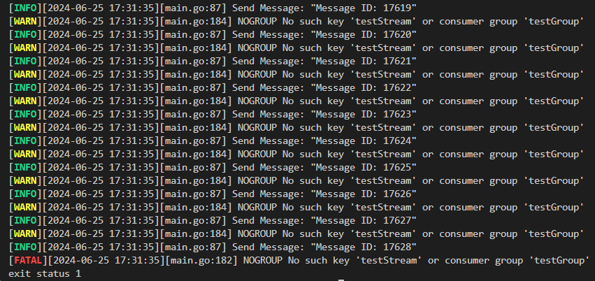

# consumer拿掉，使 memory 漲超過 max memory，觀察發生什麼事
1. 為了加速實驗過程，透過修改 docker compose file，限制 redis 的 max memory 為 3MB，這個大小能夠讓 redis 順利啟動，但很快便會被 producer 的訊息耗盡
    ```yaml
    entrypoint: [redis-server, /etc/redis/rediscluster.conf, --port,"7000", --cluster-announce-ip,"${ip}", --appendonly, yes, "--maxmemory", "3mb", "--maxmemory-policy", "allkeys-lru"]
    ```
2. 此外，修改 main.go 中的程式，註解掉 consumer 的部分，只留下 producer
    ```go
	go Producer(log) // start producer
	AutoClaim(log)   // start auto claim, auto claim will claim messages that have been idle for 300 seconds
	//Consumer(log)     // start consumer
    ```
3. 來到本專案根目錄下，先使用以下指令啟動 redis cluster
    ```shell
    docker-compose up -d --build
    ```
4. 接著透過以下指令啟動 producer-consumer model 並觀察 log 輸出
    ```shell
    go run main.go
    ```
5. producer 一開始正常運作，不斷送出 message 至 redis stream 中
   
6. 直到送到約 9000 筆訊息時，AutoClaim 的部分出現了一些不可預期的錯誤，但此時 producer 仍正常工作
   
7. 當 producer 送到約 20000 筆訊息時，redis 的 memory 全被耗盡，連 producer 送訊息時都觸發了 OOM 錯誤；在耗盡 retry 次數後，程式中止運作
   

## 總結
redis 在記憶體耗盡時，可能會出現一系列不可預期的情況跟錯誤，建議在程式中需要特別處理這種可能發生的情況，並盡可能預防 redis memory 完全被耗盡