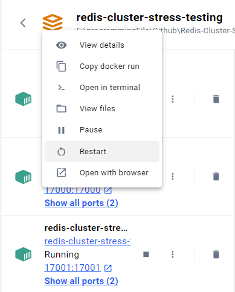
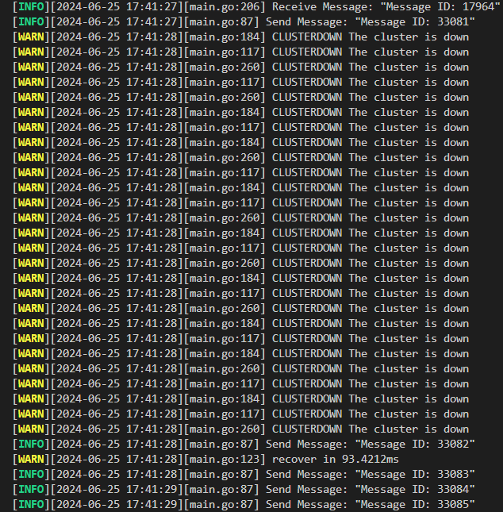
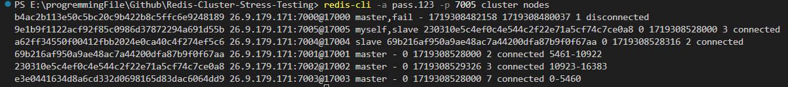
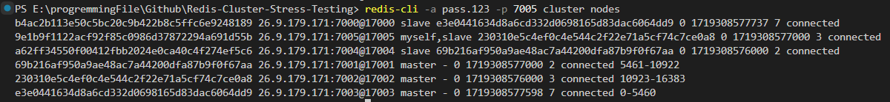

# 持續送過程中把 master 砍掉會發生什麼事，以及觀察 failover 機制
1. 來到本專案根目錄下，先使用以下指令啟動 redis cluster
    ```shell
    docker-compose up -d --build
    ```
2. 接著透過以下指令啟動 producer-consumer model
    ```shell
    go run main.go
    ```
3. 透過以下指令觀察 redis cluster 狀態
    ```shell
    redis-cli -a "replace with your redis password" -p 7005 cluster info
    ```
    輸出:
    ```
    cluster_state:ok
    cluster_slots_assigned:16384
    cluster_slots_ok:16384
    cluster_slots_pfail:0
    cluster_slots_fail:0
    cluster_known_nodes:6
    cluster_size:3
    cluster_current_epoch:6
    cluster_my_epoch:3
    cluster_stats_messages_ping_sent:19
    cluster_stats_messages_pong_sent:17
    cluster_stats_messages_meet_sent:1
    cluster_stats_messages_sent:37
    cluster_stats_messages_ping_received:17
    cluster_stats_messages_pong_received:20
    cluster_stats_messages_received:37
    total_cluster_links_buffer_limit_exceeded:0
    ```
4. 透過以下指令觀察 redis cluster node 狀態
    ```shell
    redis-cli -a "replace with your redis password" -p 7000 cluster nodes
    ```
    輸出:
    ```
    9e1b9f1122acf92f85c0986d37872294a691d55b 26.9.179.171:7005@17005 slave 230310e5c4ef0c4e544c2f22e71a5cf74c7ce0a8 0 1719308437906 3 connected
    e3e0441634d8a6cd332d0698165d83dac6064dd9 26.9.179.171:7003@17003 slave b4ac2b113e50c5bc20c9b422b8c5ffc6e9248189 0 1719308437000 1 connected
    b4ac2b113e50c5bc20c9b422b8c5ffc6e9248189 26.9.179.171:7000@17000 myself,master - 0 1719308437000 1 connected 0-5460
    a62ff34550f00412fbb2024e0ca40c4f274ef5c6 26.9.179.171:7004@17004 slave 69b216af950a9ae48ac7a44200dfa87b9f0f67aa 0 1719308438911 2 connected
    69b216af950a9ae48ac7a44200dfa87b9f0f67aa 26.9.179.171:7001@17001 master - 0 1719308438509 2 connected 5461-10922
    230310e5c4ef0c4e544c2f22e71a5cf74c7ce0a8 26.9.179.171:7002@17002 master - 0 1719308437505 3 connected 10923-16383
    ```
5. 在 docker 中，手動重啟一個 master 節點 (:7000 node)，會發現 "master 節點重啟的時間" 比 "redis cluster failover 機制判斷該節點 fail 的時間" 還短；也就是說，該 master 節點在被判定 fail 前，便即時重啟完畢，繼續運作，並沒有被切換成 slave；producer-consumer model 也正常運作
    
6. 接著為了模擬觸發 failover 的情況，手動暫停 master 節點 (:7000 node) 運作。經過數秒後， redis cluster 暫時下線，並使 producer-consumer model 不斷 retry，再經過約 0.1 秒後，redis cluster 恢復正常運作，producer-consumer model 也正常運作
    
    
7. 接著手動重啟剛剛暫停的節點 (:7000 node)，會發現該節點被切換成 slave，且不影響 producer-consumer model 的運作
    

## 總結
redis cluster 的 failover 機制，能使得資料庫能保持高可用性，是個很實用的功能，不過在進行 failover 時，正在使用服務的程式會暫時下線，需在程式中對此進行處理 (例如新增 retry 邏輯等等)，以避免程式異常終止；另外也須注意因此而導致的掉資料情況
