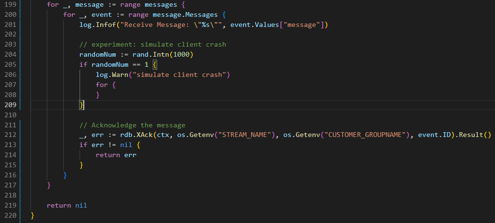
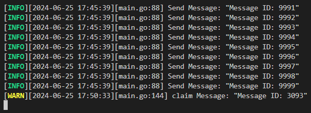

# 關掉Auto claim，觀察掉資料的情況
1. 為了模擬掉資料可能發生的情境，故移除 main.go 中 ConsumingMessage 的部分註解，讓 consumer 有小概率會發生當機，讀取了訊息卻未處理完畢 (未 ACK)，此外，也可以適當調整發送的 message 數量以及觸發 Auto claim 的時間
   
2. 來到本專案根目錄下，先使用以下指令啟動 redis cluster
    ```shell
    docker-compose up -d --build
    ```
3. 接著透過以下指令啟動 producer-consumer model，觀察 log 輸出
    ```shell
    go run main.go
    ```
4. 一開始執行時，producer 以及 consumer 都正常運作，producer 不斷送出 message 至 redis stream 中，而 consumer 也不斷地從 stream 中取出訊息，但經過一段時間後，consumer 觸發了當機機制，讀取了訊息卻未處理完畢；而 producer 仍然持續送出訊息，直到將訊息送完。最後，在偵測到某個 message 讀取後未 ACK 一段時間，Auto claim 機制將會自動將該訊息重新 claim 回來處理；也就是說，若是沒有 Auto claim 機制，則未處理完的訊息可能丟失
    