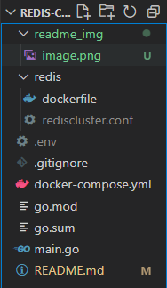
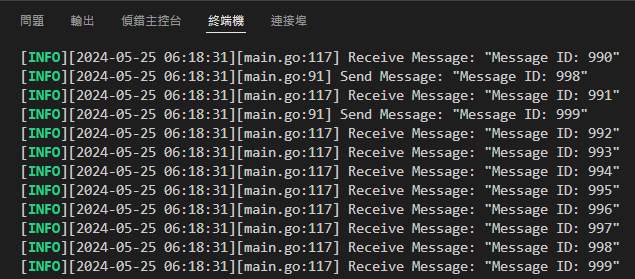

# Redis-Cluster-Stress-Testing
## Redis cluster 環境配置
專案目錄將會如下

### 於 redis 資料夾中新增 rediscluster.conf 檔案
範例
```shell
# ip
bind 0.0.0.0
# 啟用 cluster
cluster-enabled yes
# 指定 cluster config 檔案
cluster-config-file nodes.conf
# 指定 node 無法連線時間
cluster-node-timeout 5000
#設置主服務的連接密碼
masterauth 「自行設定的 redis 資料庫密碼」
#設置從服務的連接密碼
requirepass 「自行設定的 redis 資料庫密碼」
```

### 於專案根目錄中新增 .env 檔案
範例
```shell
REDIS_PASSWORD=「自行設定的 redis 資料庫密碼，要與 rediscluster.conf 一致」
STREAM_NAME= 「用來交換訊息的 stream name」
CUSTOMER_GROUPNAME=「customer 的 group name」
MaxEntries=「預先置入的最大訊息數量，用於控制記憶體使用量」
Publishing_message_num=「producer 送出的訊息數」
Redis_Maxmemory=「用於控制 docker-compose file 中的 --maxmemory 參數」
REDIS_RECONNECT_PERIOD=「用於控制 redis 再次 reconnect 前，等待的間隔」
REDIS_HOOK_ON=「是否開啟實現 redis reconnect 邏輯的 redis hook」
```

### 啟動 Redis Cluster 以及 producer-consumer model
```shell
docker-compose up -d --build
```

如果在 producer-consumer model 輸出的 log 中看到類似以下的資訊，即為成功


### 確認 redis cluster 是否正常運作
```shell
redis-cli -a 「自行設定的 redis 資料庫密碼」 -p 7000 cluster info
```

如果輸出類似以下資訊，代表 Redis Cluster 已經正常運作
```
cluster_state:ok
cluster_slots_assigned:16384
cluster_slots_ok:16384
cluster_slots_pfail:0
cluster_slots_fail:0
cluster_known_nodes:6
cluster_size:3
cluster_current_epoch:6
cluster_my_epoch:2
cluster_stats_messages_ping_sent:63
cluster_stats_messages_pong_sent:69
cluster_stats_messages_meet_sent:4
cluster_stats_messages_sent:136
cluster_stats_messages_ping_received:68
cluster_stats_messages_pong_received:67
cluster_stats_messages_meet_received:1
cluster_stats_messages_received:136
```

### 查看 Redis Cluster node 狀態
```shell
redis-cli -a 「自行設定的 redis 資料庫密碼」 -p 7000 cluster nodes
```

如果輸出類似以下資訊，代表 Redis Cluster 已經正常運作
```shell
7e793eb8a2134550d9a285713f52ddaf8cc89189 26.9.179.171:7003@17003 slave 7651df59f610c9619ea8ecef840737344a762e12 0 1719301574086 3 connected       
a1c228d29fba6e1e0360f0caf5863f33688a93d0 26.9.179.171:7004@17004 master - 0 1719301573000 7 connected 0-5460
890b48ca513fd553e3319505e442c751cd25a1ea 26.9.179.171:7000@17000 myself,slave a1c228d29fba6e1e0360f0caf5863f33688a93d0 0 1719301573000 7 connected
cc4a188cf6ba936c097776f1a1fe203395f710bb 26.9.179.171:7001@17001 slave eb672df8d3073c0327084123bda8f022216b239e 0 1719301574488 8 connected       
eb672df8d3073c0327084123bda8f022216b239e 26.9.179.171:7005@17005 master - 0 1719301572982 8 connected 5461-10922
7651df59f610c9619ea8ecef840737344a762e12 26.9.179.171:7002@17002 master - 0 1719301573485 3 connected 10923-16383
```

## 實驗
- [consumer拿掉，使 memory 漲超過 max memory，觀察發生什麼事](Exp1_TranditionalChinese.md)
- [持續送過程中把 master 砍掉會發生什麼事，以及觀察 failover 機制](Exp2_TranditionalChinese.md)
- [關掉Auto claim，觀察掉資料的情況](Exp3_TranditionalChinese.md)
- [是否開啟 Aof 對本次實驗架構的影響](Exp4_TranditionalChinese.md)
- [不同的 redis 記憶體上限限制對於性能的影響](Exp5_TranditionalChinese.md)
- [關於 redis connection pool timeout 的發生原因及解決方法探討](Exp6_TranditionalChinese.md)
- [關於 redis EOF 的發生原因及解決方法探討](Exp7_TranditionalChinese.md)
- [開啟實驗七中的 redis Hook 對於性能的影響](Exp8_TranditionalChinese.md)

## 參考資料
1. https://pdai.tech/md/db/nosql-redis/db-redis-data-type-stream.html?source=post_page-----2a51f449343a--------------------------------
2. https://blog.yowko.com/docker-compose-redis-cluster/
3. https://www.yoyoask.com/?p=6051
4. https://blog.csdn.net/weixin_43798031/article/details/131322622
5. https://www.cnblogs.com/goldsunshine/p/17410148.html